# Personal Profile
Name: Nidal Danial
Student #: 1005737543

this repo is a clone of https://github.com/varadbhogayata/varadbhogayata.github.io

# Activity 1
showing proof of Github repo:

# Activity 2
showing completion of profile through the following photos:

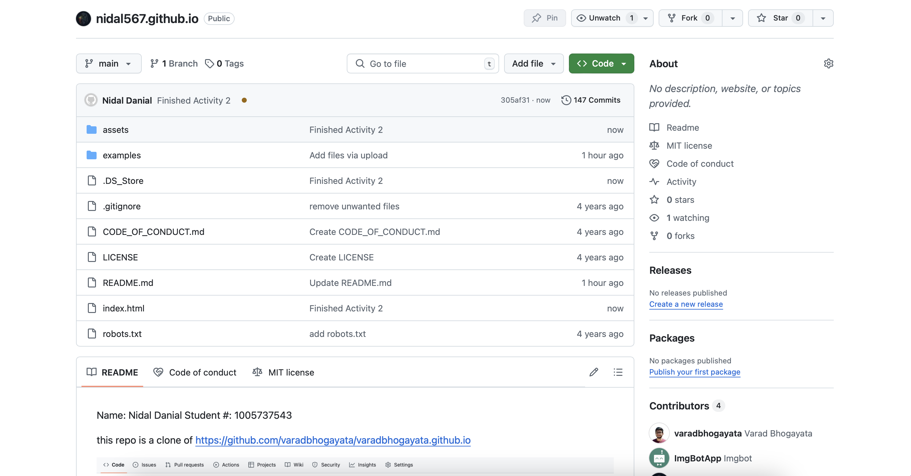

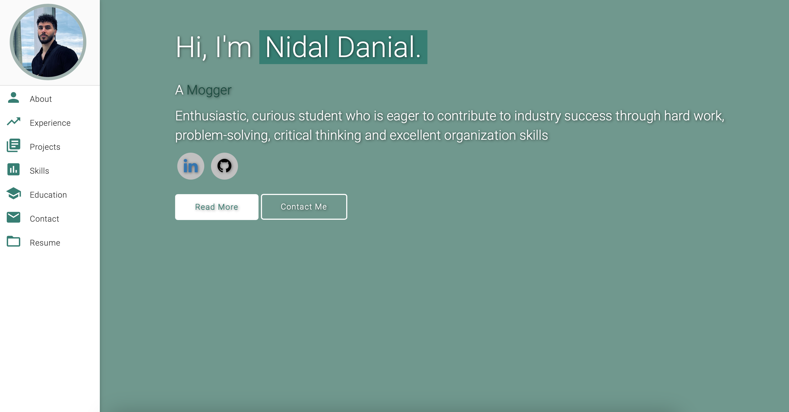

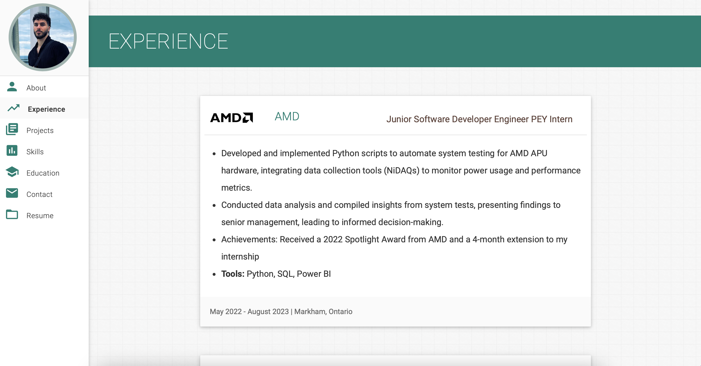

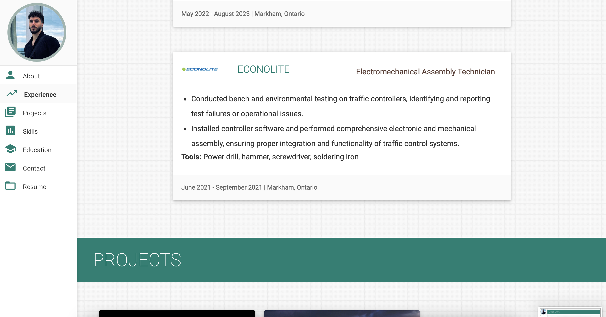

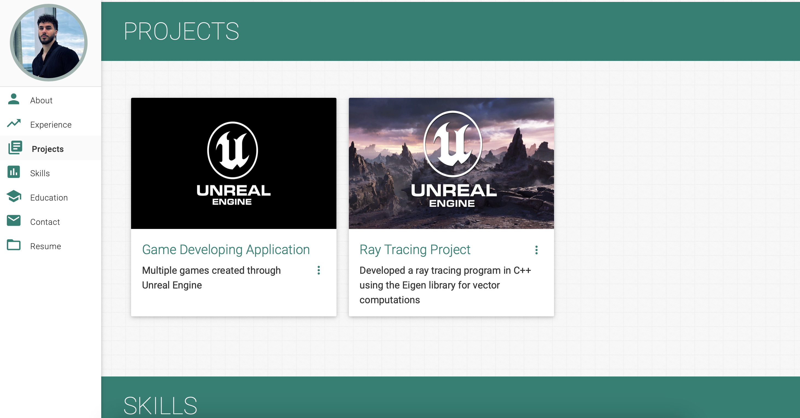

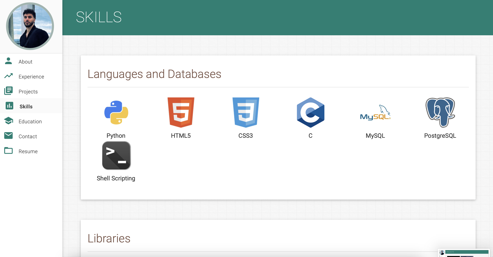

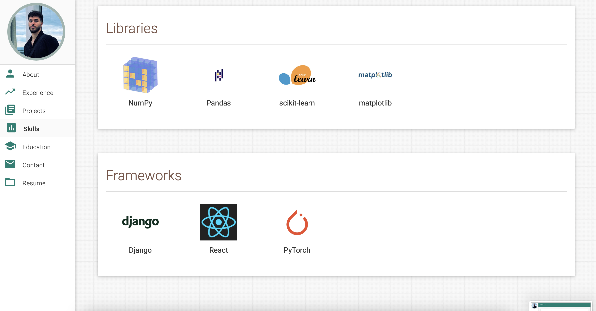

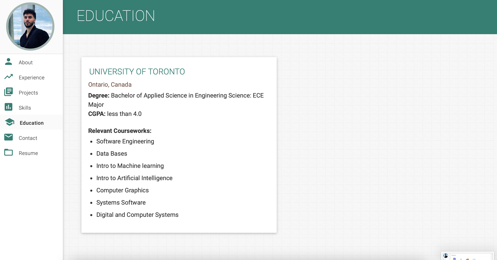

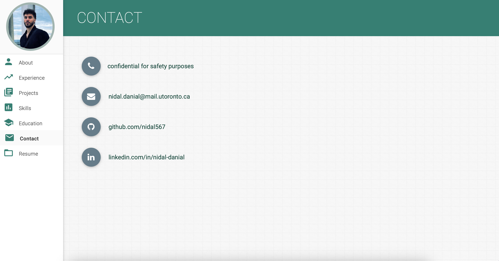

# Activity 3
different colour theme shown in the following photos:

# Activity 4
Google maps for places I've travelled:

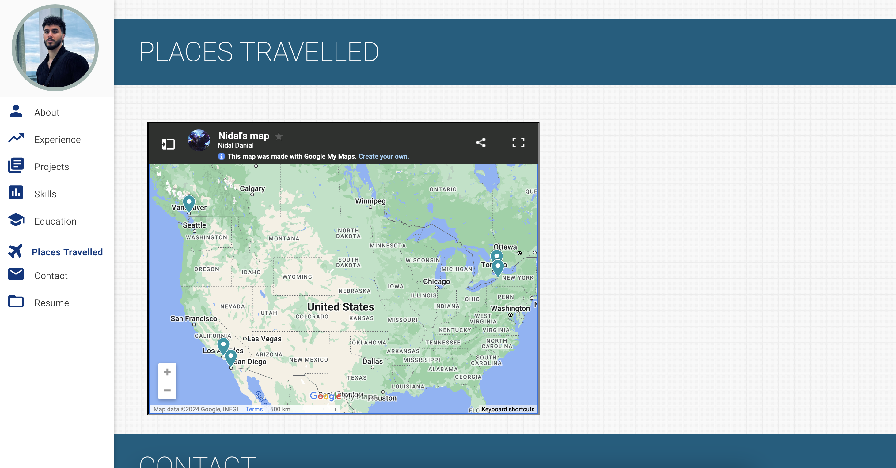

# Activity 5
completing the dynamically allocated projects:

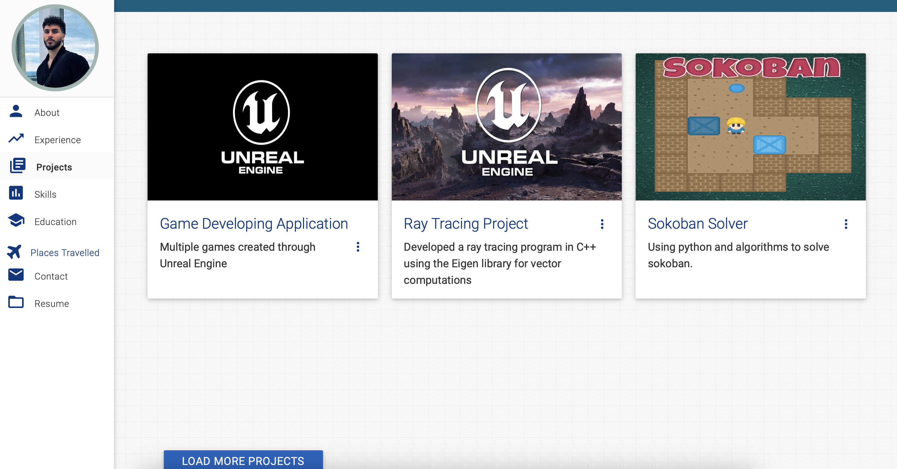

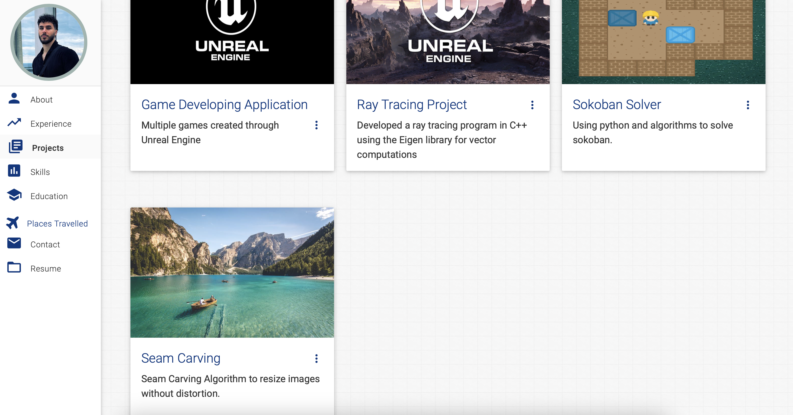

# Repo for Activity 4 and 5:
Forgot to screenshot the repo after each change or final section adjustment:

